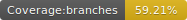
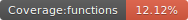
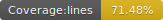
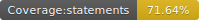

# Miniops

<p float="left">
  
  
  
  
</p>


<p style="text-align:center">
  </img>
</p>


A little and friendly buddy to help you in your devops automations.

## requirements

- Nodejs
  - For windows users https://nodejs.org/en/download
  - For linux users I don't need to explain it

- miniops tool

```
npm install usil/tiny-devops#1.0.0-snapshot
```

- Pm2

```
npm install -g pm2
```

- Validate the pm2

```
pm2 --version
```

- Clone this repository

## Run

```
set GIT_URL=http://192.168.0.66:6000/asp-wacala.git
set GIT_BRANCH=develop
set YAML_LOCATION=C:\foo\bar\real_001.yaml
npm run init
```

## Logs

```
pm2 logs devops
```

## Delete

```
pm2 delete devops
```

## References

https://betterstack.com/community/guides/scaling-nodejs/pm2-guide/


## Acknowledgments

- https://easydrawingguides.com/how-to-draw-bob-the-minion/

## Contributors

<table>
  <tbody>    
    <td>
      
      <br />
      <label><a href="http://jrichardsz.github.io/">JRichardsz</a></label>
      <br />
    </td>
  </tbody>
</table>