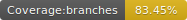
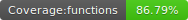
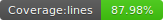
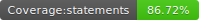
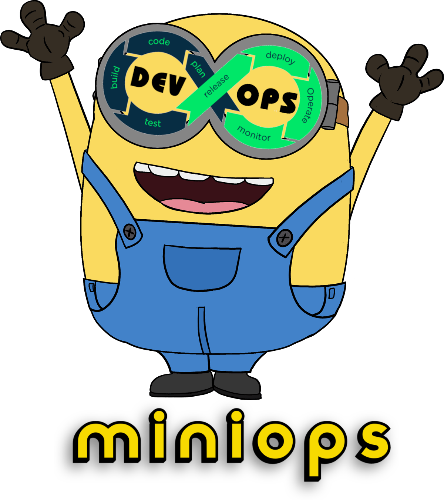

# Miniops

<p float="left">
  
  
  
  
</p>


<p align="center">
  </img>
</p>


A little and friendly buddy to help you in your devops automations.

## requirements

- A  hello world  of your favourite language in a git repository

- Git
  - For windows users https://git-scm.com/download/win
  - For linux users I don't need to explain it

- SSH for git
  - Configure the ssh keys of your favourite git platform (github, bitbucket, gitlab, etc). Check [this](https://gist.github.com/jrichardsz/cfed8ee22ac89c04b6e85cb84dd66617)
  - For windows, I advice you the [pageant.exe](https://www.chiark.greenend.org.uk/~sgtatham/putty/latest.html)

- Nodejs
  - For windows users https://nodejs.org/en/download
  - For linux users I don't need to explain it

- miniops tool

```
npm install -g https://github.com/usil/miniops.git#1.0.0-snapshot
```

## Yaml

Similar to the yaml of gitlab, bitbucket, github actions, etc we need to create a valid yaml. You could use one of [these templates](https://github.com/usil/miniops/wiki/Yaml-templates_)

## Variables

**Windows**

```
set cron_expression=*/15 * * * * *
set git_url=https://github.com/usil/asp-classic-hello-world.git
set git_branch=develop
set yaml_full_location=C:\foo\bar\acme.yaml
set log_level=debug
set log_file_location=C:\foo\bar\acme-devops.log
```

**Linux**

```
export cron_expression="*/15 * * * * *"
export git_url=https://github.com/foo/java-web-hello-world.git
export git_branch=develop
export yaml_full_location=/foo/bar/acme.yaml
export log_level=debug
export log_file_location=/foo/bar/acme-devops.log
```

## Run (direct execution)

```
miniops --mode=direct
```

## Run (polling execution)

**linux**

```
nohup miniops --action=start >/dev/null 2>&1 &
```

**windows**

```
START "miniops" /B miniops --action=start > NUL
```

> close the cmd window :/

## Stop

```
miniops --action=stop
```

## Check status

```
miniops --action=status
```

## Update

To try the latest or custom version:

- delete it

```
npm uninstall -g https://github.com/usil/miniops.git#1.0.0-snapshot
npm uninstall -g miniops
```

- clone or pull
- start again

## Advanced settings

For notitifations, templates, plugins, etc go to the [wiki](https://github.com/usil/miniops/wiki)

## Acknowledgments

- https://easydrawingguides.com/how-to-draw-bob-the-minion/
- https://www.textstudio.com/logo/minions-411

## Contributors

<table>
  <tbody>    
    <td>
      
      <br />
      <label><a href="http://jrichardsz.github.io/">JRichardsz</a></label>
      <br />
    </td>
  </tbody>
</table>